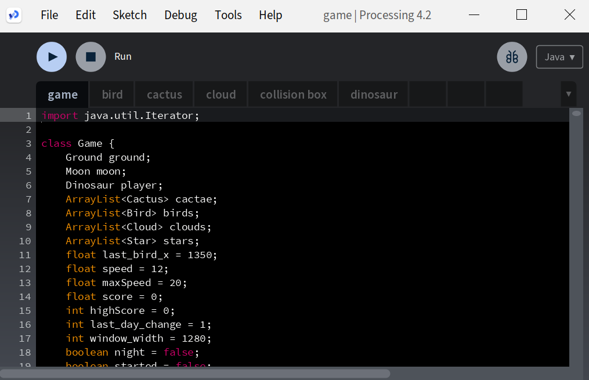

# Dinosaur Game

<a name="readme-top"></a>


[![Contributors][contributors-shield]][contributors-url]
[![Forks][forks-shield]][forks-url]
[![Stargazers][stars-shield]][stars-url]
[![MIT License][license-shield]][license-url]


<br />
<div align="center">
  <a href="https://github.com/diegoal3mx/Dinosaur_Game">
    
  </a>

<h3 align="center">Dinosaur Game - Processing</h3>

  <p align="center">
    Chrome's Trex Runner Game built with Processing
    <br />
  </p>
</div>

<details>
  <summary>Table of Contents</summary>
  <ol>
    <li>
      <a href="#about-the-project">About The Project</a>
      <ul>
        <li><a href="#built-with">Built With</a></li>
      </ul>
    </li>
    <li>
      <a href="#playing-the-game">Playing the game</a>
      <ul>
        <li><a href="#prerequisites">Prerequisites</a></li>
        <li><a href="#how-to-play">How to play</a></li>
        <li><a href="#controls">Controls</a></li>
      </ul>
    </li>
     <li><a href="#disclaimer">Disclaimer</a></li>
    <li><a href="#license">License</a></li>
    <li><a href="#contact">Contact</a></li>
    <li><a href="#acknowledgments">Acknowledgments</a></li>
  </ol>
</details>


## About The Project


Processing version of Google Chrome's offline t-rex runner game, with infinite gameplay & cactuses and birds to avoid!

### Built With

* [![Processing][Processing]][Processing-url]

<p align="right">(<a href="#readme-top">back to top</a>)</p>

## Playing the game

### Prerequisites

* Processing
  * Processing can be downloaded [here](https://processing.org/download)

### How to play

1. Clone the repo
   ```sh
   git clone https://github.com/diegoal3mx/Dinosaur_Game.git
   ```
2. Open "game.pde" in Processing

3. Click the "Run" button


<p align="right">(<a href="#readme-top">back to top</a>)</p>

## Controls

* **Start: `SPACE`** <br/>
* **Jump: `ARROW UP` , `SPACE`** <br/>
* **Crouch: `ARROW DOWN`** <br/>

<p align="right">(<a href="#readme-top">back to top</a>)</p>

## Disclaimer

* The products, company names, images and logos mentioned on this game are trademarks of their respective owners.
* Tested on Windows 10

<p align="right">(<a href="#readme-top">back to top</a>)</p>

## License

Distributed under the MIT License. See [`LICENSE.txt`](https://github.com/diegoal3mx/Dinosaur_Game/blob/main/LICENSE.txt) for more information.

<p align="right">(<a href="#readme-top">back to top</a>)</p>


## Contact

Project Link: [https://github.com/diegoal3mx/Dinosaur_Game](https://github.com/diegoal3mx/Dinosaur_Game)

<p align="right">(<a href="#readme-top">back to top</a>)</p>


## Acknowledgments

* Inspired by : [Santifiorino](https://github.com/santifiorino)

<p align="right">(<a href="#readme-top">back to top</a>)</p>

[contributors-shield]: https://img.shields.io/github/contributors/diegoal3mx/Dinosaur_Game.svg?style=for-the-badge
[contributors-url]: https://github.com/diegoal3mx/Dinosaur_Game/graphs/contributors
[forks-shield]: https://img.shields.io/github/forks/diegoal3mx/Dinosaur_Game.svg?style=for-the-badge
[forks-url]: https://github.com/diegoal3mx/Dinosaur_Game/network/members
[stars-shield]: https://img.shields.io/github/stars/diegoal3mx/Dinosaur_Game.svg?style=for-the-badge
[stars-url]: https://github.com/diegoal3mx/Dinosaur_Game/stargazers
[license-shield]: https://img.shields.io/github/license/diegoal3mx/Dinosaur_Game.svg?style=for-the-badge
[license-url]: https://github.com/diegoal3mx/Dinosaur_Game/blob/main/LICENSE.txt
[linkedin-shield]: https://img.shields.io/badge/-LinkedIn-black.svg?style=for-the-badge&logo=linkedin&colorB=555
[linkedin-url]: https://linkedin.com/in/linkedin_username
[Processing]: https://img.shields.io/static/v1?style=for-the-badge&message=Processing&color=006699&logo=data:image/png;base64,iVBORw0KGgoAAAANSUhEUgAAAC0AAAAtCAYAAAA6GuKaAAAAIGNIUk0AAHomAACAhAAA+gAAAIDoAAB1MAAA6mAAADqYAAAXcJy6UTwAAAAGYktHRAD/AP8A/6C9p5MAAAAHdElNRQfnBwYSFh0w4qxGAAAH/ElEQVRYw9WZbXBUVxnHf+fu3cSwgbxAEgpJilBSXoK8CK1NwSq0jdNqLaNMrX5ACh+stXXaqrXMODAdUWcsomkdqDCDjB3baUZbKiLpFAaC8jYghJI0CZJCCAlJIOR1k2z27uOHc3ezm927uyHY1mfmfjnn3HN+57n/e85znqNI0kQkVnEOsBAoARYDM4FcIB0wAT/QC7QB54GTwBHgNNA+sjOlVFIsCVvFgDWB+cBKoBQoAiYkO3mgG6gHKoC3gSp7cqOGdwQOe5SI3C0iO0WkXW6Ntdv93W33HxrvVgDnicgmEWm9RbAjrdXuP++mwUcAl4hI5c3SDA6JeH0iQ1ZSzSvt8eKCq1jAYbYKeBkovFmJ/f6g8Na/FRM9MDUT7sgR5ucr5t4GOeNjvtII/AgoD0GO0LgZB3g18Bsg+2aBAS60Q2UNYNguUgpPKszIEUrnwKpFsKhQ4TJCrxQC24BxwK4gVzh4CDqGh8cMDGAYgMuGtq3PB2cvK85ehp1HYdUi4YfLFXfmhZpk2+N7gx4PBzdiAJegJTFm4Piz0c+1Hth6UPH1rVB+SghDybY5SkY61hjRVR7wK8ag4VGb0hR1LbDudcXvDoA/EKottHnywl8xwrysgGeAZR8bcAQJdPfD+t2wrTKiZpnNpUB7O9zTdwHrPhHgoCno98GGPbD3XIRk19l8wfkB+of8HjpuGJM1tXg5fLyNQEAPagUACwgAyewXCjp6YMMeRXNnqDTX5jMBXBs3bgQd9LyEXmZu2voHLDZsPsuW7bX4hgLMm5WJy+3CkwZTMsFlCD0DCstP/KhHQXMnZHvgizNDpfnA+0BLcMlbCUwaq5d3lTewu6KJoaEAW7bXUl3Xxfpn5vKH70xgyILrvYpjH8GOI1BRDX4rDrzA6ydg9RcgPwtsvpXAKQMdXpaOFbjyWCuv7qxjyB/AMBQisPdAM2ufP87eA1cwDWFyBjy6AN5cCy99DTypOEvGgPpW2F8X0aAUyDHQ0igaC3DjlT42lVXT3jGIEbZzuVyKuoZunt1wis2vfUhnlw+A9FR4oRSeXSEow7nfgB/21yoCw9xFwEIDvXiPJh6OsP4Bi19vraGq5gYuI/pbuwxFd6+fza/Vsqu8YdiRCp7+smJRgeifNJYpqGoSOvpCJROAEgN94kho3kHo6I0u31XewDsVTSjD+c8SEaYXelixdHJEee54eHQ+zrpW0NoN13ojJLLYRB+RnD3pg/MtwulL4DLgG3cp0lJ03aFwHTucNkRgfLqbF56aS/GszKj6BQXgNmHIig3tHVJ09keUzjRxWJuDsGcuQUunwh/Q0PUtwvzbFY1X+vhFWTXt1wdxuZy9rBQ88dh0vnr/1Jj1GWngdjlAo9f5wYjDGLkm+hAaF9ZQ+rECUNWomJrhH9ZxHGDLEh68bzJPri7CcJBP74C99DmYoSDFFVGUbhIWnvr8UFEl1DYrLBmGDe+grRteebOZd9+Lr+NAQLhjWjovPl1M5oQUx3YfNOtxY+paYFyKkJFGeAPTIOwknGJCVrpeYpx4/BZ0DHlwud2Oa2y4jufMzHAEvuGF3VU4r9UCOekwKUIL+A10XiJknyuELA9IHKDb8rOZPmuKY6NEOg7a9n/C8YsqOkAOg543VTHRE+HBXgOdSAlZlgeKC+KOhWEq5i6aRponNYrbsoQVS/Pi6tjnh62HhF/uAyuOnpULlt8p4UcxgDYDnfmJsOKCBN4OQN6UrChvJ9JxVz8cOg9r/yQ89xdFp5e4scf0SXD/rKgG5010qurhWN4+XJvY2w21zfR79fYcS8fvfxjgQB209iiqmxU1V6HHq4YPunHsW0vgs9Fh3EkTnVvrZsRWXlwA55rgRq/WaDxvnzv1EYahWBNDx3vPKbZUhEHax6u4FoDifFh3b1RNN3DEQCcD60fWZnn0i07eUApMt2LG7CmYbhfL783j+zF0HDqNB0/kidJ0Aulp8LOHhGkTo2rrgdMGOntZEev9CzWX6b7RF+FppUAZ4O0d5MzxBo7ur2Fa/jjWJ1iPkzLRW/qLpcI3F8acXQXQHvxQbwPXwmsPHWvl5VerqK1qjII9e6KBd//8Lw7+/Qzerh5+8uQc5hRlMCYT+EwKrP8KPP+A0l8o0q7ZnKHdsArYA3wXCMUVbdcGCHxwmdnzC3GnuvlPTRM1py/S3tKFZelg/4nHZyRcjxPBIpA/UUtizT0Ktytmyz02Zwjaj05FPdTn9ecG4wrTNOi60UvlvrN4+wZoa+4kYAVQ9slkxdLYOh4NbHoaPDwPfvwAfL7QsZ82m88fDg1wAtjx3qGW9e9UNIVSUCLQUNcM6ESgMlTScQWgTx3BIF8ABaYJBVnwpSLh20sUy2ZCqhm3mx02HwCmUiqYbhKgbN7szGWPPXL7svK/NTLoszAMFZH8SzauCFp+JiyYpoOe3PEwa7JiYYGwsEBRmK1I4iMdBspsPu04DSJBJwCUDAxYb7yx+2Lhb3fUcrVtICr8/MGaIn761NykZOH1gc8SUlyQaqqRW3IiawQeR+8lw1972INRWdNtR0+1Z28qO8fJqg6U0rJ48L7JvPLzJWNf3hJbBzpB45inDoGHPatF5PqVq33y3MaTkr/4r3LPI/ukur7zf3SDEWHX7fGTu8oYAb5KRC71D/jlj29dkH8cuPJxAF+yxx3d3YvcwjuXUVpSdy7Jgn/6b7ccwD8194j/lze2Se+/DrP/RO7G/wvvIceHLcerbAAAACV0RVh0ZGF0ZTpjcmVhdGUAMjAyMy0wNy0wNlQxODoyMjoxOSswMDowMO7sN7cAAAAldEVYdGRhdGU6bW9kaWZ5ADIwMjMtMDctMDZUMTg6MjI6MTkrMDA6MDCfsY8LAAAAKHRFWHRkYXRlOnRpbWVzdGFtcAAyMDIzLTA3LTA2VDE4OjIyOjI5KzAwOjAwRiupNwAAAABJRU5ErkJggg==&logoColor=FFFFFF&label=
[Processing-url]:https://processing.org/
